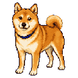
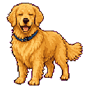
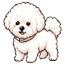
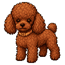
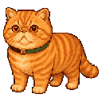

# 拼豆宠物 · 2D 互动像素宠物

[](https://github.com/cheryl1595212353-ux/pindou-pet/actions/workflows/ci.yml)

一个温暖、可操作的 2D 像素宠物空间。用户可以切换宠物和生活场景，
通过点击、长按、方向控制、动作按钮和文字聊天与宠物互动。

当前默认首页无需启动项目 API 或 Redis。未配置外部模型时仍可完整运行，
聊天会自动使用本地回复；配置 DeepSeek 后可获得带独立宠物档案和上下文的
角色对话。

| 豆包 · 红柴犬 | 金宝 · 金毛 | 雪团 · 比熊 | 可可 · 棕色泰迪 | 橘团 · 异国短毛猫 |
| :---: | :---: | :---: | :---: | :---: |
|  |  |  |  |  |

## 当前功能

- 5 只可切换宠物：红柴犬、金毛、比熊、棕色泰迪和橘色异国短毛猫。
- 6 个独立场景：客厅、花园、海滩、雪地小屋、星光露营和城市屋顶。
- 16 个宠物状态，包括呼吸眨眼、左右及前后移动、开心、跳跃、等待、睡眠、
  喂食、抚摸、玩球、梳毛、洗澡、跳舞和拍照。
- 宝可梦式像素对话框支持 DeepSeek 角色对话；五只宠物分别拥有固定档案、
  独立短期对话历史和不同口吻，服务不可用时自动回退本地关键词回复。
- 7 种独立心情会在对话框中显示标签和颜文字，并在宠物周围短暂闪烁
  爱心、音符、星星、问号或睡眠符号。
- 支持鼠标、触摸和键盘输入；点击场景可让宠物沿直线走到目标点，四个
  键盘方向键也可以带宠物散步。
- 宠物大小可在 `70%–125%` 间调整，阴影随尺寸和前后景深同步变化。
- 12 秒无操作后进入等待，30 秒无操作后睡觉，有效互动会重新唤醒宠物。
- 玩具球、梳毛刷、竖直花洒、水流泡泡、拍照闪光和食盆等动作道具会随
  状态出现；
  食盆与嘴部对位，玩具球位于头部前方。
- 所有宠物动画和场景资源都保存在仓库内，运行时不依赖 CDN 或远程图片。
- 支持键盘焦点、状态播报、资源错误提示和 `prefers-reduced-motion`。

## 快速开始

### 环境要求

- Node.js 24
- pnpm 11.9.0（通过 Corepack 使用）

仓库中的 `.nvmrc` 已固定 Node.js 主版本：

```bash
nvm use
corepack enable
pnpm install --frozen-lockfile
```

启动 2D 像素宠物前端：

```bash
pnpm --filter @pindou/web dev --host 127.0.0.1
```

浏览器访问：

```text
http://127.0.0.1:5173/
```

聊天默认可以直接使用本地回复。如需启用 DeepSeek，在 Web 应用目录创建
只供本机使用的配置文件：

```bash
cp apps/web/.env.example apps/web/.env.local
# 编辑 apps/web/.env.local，填写 DEEPSEEK_API_KEY
```

`.env.local` 已被 Git 忽略。DeepSeek 转发目前只由 Vite 的开发服务器和
`vite preview` 提供；纯静态生产部署若没有同路径反向代理，会自动回退到
本地回复。

也可以从零克隆后运行：

```bash
git clone https://github.com/cheryl1595212353-ux/pindou-pet.git
cd pindou-pet
nvm use
corepack enable
pnpm install --frozen-lockfile
pnpm --filter @pindou/web dev --host 127.0.0.1
```

## 互动方式

| 操作 | 触发方式 | 结果 |
| --- | --- | --- |
| 切换宠物 | 点击左侧宠物卡片 | 更换宠物形象、名称、介绍和完整动画图集 |
| 切换场景 | 点击场景缩略卡 | 保留当前宠物和位置，更换生活空间 |
| 打招呼 | 单击宠物 | 宠物进入开心状态 |
| 抚摸 | 长按宠物约 240ms 或拖动 | 宠物持续享受抚摸，松开后恢复空闲 |
| 散步 | 点击场景、按住左右按钮或使用键盘方向键 | 宠物沿直线走到点击位置，也可手动左右或前后移动 |
| 调整大小 | 拖动“宠物大小”滑块 | 在 `70%–125%` 间调整宠物、阴影和道具 |
| 宠物聊天 | 点击“和宠物聊天”，输入文字并发送 | 优先获得符合宠物档案和上下文的回复；不可用时回退本地回复，同时显示心情与像素符号 |
| 丰富互动 | 点击跳跃、喂食、玩球、梳毛、洗澡、跳舞或拍照 | 播放对应动作并显示状态或道具 |
| 叫醒 | 点击叫醒按钮或产生有效输入 | 从等待或睡眠状态回到呼吸眨眼 |

宠物的水平活动范围为 `x = 8–92`，前后范围为 `y = 20–80`。靠近左侧
边缘玩球时，宠物和球会一起镜像到安全方向。

## 技术实现

### 前端

- React 19
- TypeScript 5.9
- Vite 7
- Vitest + Testing Library
- CSS 精灵图动画与响应式布局

每只宠物使用相同的精灵图合同：单帧为 `192×208`，每行最多 8 帧，
共 9 行动画。16 个产品状态由 reducer 状态机映射到这些动画行，
一次性动作结束后自动回到呼吸眨眼状态。

聊天优先通过 Vite 代理请求 DeepSeek。系统提示包含宠物固定档案、当前
场景和动作状态，每只宠物分别保留最近 12 条对话；请求失败、超时或未配置
密钥时，前端自动使用本地规则模型。心情状态不占用新的精灵图动画行。

### 仓库基础设施

仓库还保留了项目早期搭建的后端和合同基础设施：

- FastAPI、SQLAlchemy、Alembic
- Redis 7、RQ
- OpenAPI 快照与生成的 TypeScript 合同
- GitHub Actions 全量检查

这些基础设施不是运行当前 2D 首页的必要条件。

## 项目结构

```text
.
├── apps/
│   ├── web/
│   │   ├── public/pixel-dog/       # 宠物精灵图、基础图和六个场景
│   │   └── src/app/pixel-dog/      # 当前 2D 互动页面、状态机与测试
│   └── api/                        # FastAPI 基础设施与测试
├── packages/contracts/             # OpenAPI 快照和 TypeScript 合同
├── docs/
│   ├── product/                    # 当前功能和前端设计说明
│   ├── prompts/                    # 前端视觉优化 Prompt
│   ├── qa/                         # 可机器读取的验收记录
│   └── superpowers/                # 历史设计与实施计划
├── migrations/                     # Alembic 数据库迁移
├── experiments/                    # 历史视觉原型
├── Makefile
├── package.json
└── pyproject.toml
```

主要入口：

- [`PixelDogStudio.tsx`](apps/web/src/app/pixel-dog/PixelDogStudio.tsx)
- [`petChatAgent.ts`](apps/web/src/app/pixel-dog/petChatAgent.ts)
- [`petChatModel.ts`](apps/web/src/app/pixel-dog/petChatModel.ts)
- [`pixelDogModel.ts`](apps/web/src/app/pixel-dog/pixelDogModel.ts)
- [`petCatalog.ts`](apps/web/src/app/pixel-dog/petCatalog.ts)
- [`sceneCatalog.ts`](apps/web/src/app/pixel-dog/sceneCatalog.ts)
- [`styles.css`](apps/web/src/app/styles.css)

## 测试与构建

只验证当前 Web 产品：

```bash
pnpm --dir apps/web test
pnpm --dir apps/web typecheck
pnpm --dir apps/web build
```

运行仓库级检查需要 Python 3.12 和 uv 0.11.29：

```bash
uv python install 3.12
uv sync --frozen --extra dev
pnpm install --frozen-lockfile
make check
```

Redis 集成测试不会静默回退到内存 fake。需要真实 Redis 时可以运行：

```bash
docker run --rm --name pindou-redis \
  -p 127.0.0.1:6379:6379 redis:7-alpine

RUN_REDIS_TESTS=1 \
PINDOU_REDIS_URL=redis://127.0.0.1:6379/15 \
make redis-smoke
```

## 可选 API 启动

当前 2D 首页不调用仓库内的 FastAPI。只有在继续开发后端基础设施时，才
需要执行以下步骤：

```bash
cp .env.example .env
mkdir -p var
PINDOU_DATABASE_URL=sqlite:///var/pindou.db \
  .venv/bin/python -m alembic upgrade head

PYTHONPATH=apps/api/src \
  .venv/bin/python -m uvicorn \
  pindou_pet.main:create_app \
  --factory \
  --host 127.0.0.1 \
  --port 8000
```

后端本地密钥只应写入 `.env`，DeepSeek 密钥只应写入
`apps/web/.env.local`；运行数据和私有图片只应写入已被 Git 忽略的
`var/`，这些内容均不得提交到仓库。

## 当前产品边界

当前交付聚焦于 2D 像素宠物互动，不包含：

- 用户照片上传或自动生成宠物
- 3D、体素、OBJ、WebGL 或 AR 展示
- 账号、云端保存、成长数值、商城或支付
- 可用的拼豆编辑器和导出流程

仓库中仍保留部分历史 3D/体素实验模块和编辑、房间、导出路由边界，
但它们没有接入当前默认首页，也不代表当前产品能力。

## 协作登记

新增需求或报告 Bug 时，请使用
[需求与 Bug 协作登记表](REQUIREMENTS_AND_BUGS.md)。文档包含统一编号、
状态、优先级、可复制模板和推荐 GitHub 提交流程。

## 设计与验收文档

- [多宠物 2D 互动前端设计与功能说明](docs/product/multi-pet-frontend-design-features.md)
- [多宠物 2D 互动像素宠物功能规格](docs/product/interactive-pixel-dog-feature-spec.md)
- [本地聊天与情绪反馈设计](docs/superpowers/specs/2026-07-28-pixel-pet-chat-emotions-design.md)
- [本地聊天与情绪反馈实施计划](docs/superpowers/plans/2026-07-28-pixel-pet-chat-emotions.md)
- [多宠物场景与互动验收数据](docs/qa/multi-pet-scenes-interactions-qa.json)
- [本地聊天与情绪反馈验收数据](docs/qa/pixel-pet-chat-emotions-qa.json)
- [前端视觉优化 Prompt](docs/prompts/frontend-visual-optimization-prompt.md)

## 许可证

仓库目前尚未添加开源许可证。对外分发或允许第三方复用前，请先补充合适的
`LICENSE` 文件。
